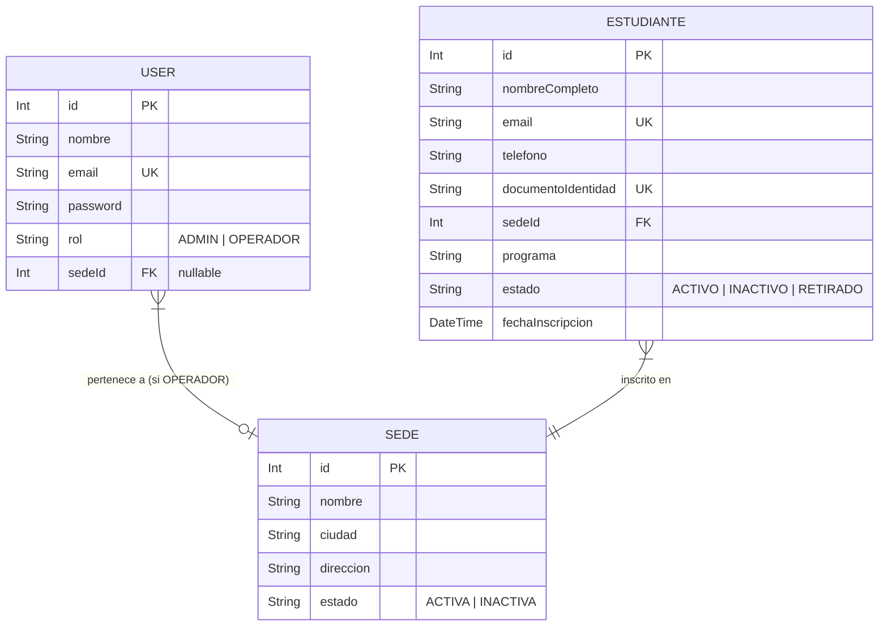

# DNA Music — Sistema de Gestión de Estudiantes

> Prueba técnica para Desarrollador Backend Jr.

## 1. Cómo correr el proyecto localmente

1. Clona este repositorio:
   ```bash
   git clone <url-del-repo>
   cd dnamusic
   ```

2. Inicia la base de datos utilizando Docker Compose (en la raíz del proyecto):
   ```bash
   docker compose up -d
   ```
   *(Esto levantará un contenedor de PostgreSQL en el puerto `5432` con usuario `postgres`, contraseña `123456` y base de datos `dnamusic`)*

3. Instala dependencias y prepara el **Backend**:
   ```bash
   cd api
   npm install
   cp .env.example .env
   npx prisma generate
   npx prisma db push
   npm run seed
   npm run dev
   ```
   > El servidor backend correrá en `http://localhost:3000`

4. Instala dependencias y arranca el **Frontend** (en otra terminal):
   ```bash
   cd ..
   cd web
   npm install
   npm run dev
   ```
   > El cliente frontend correrá en `http://localhost:5173`

## 2. URLs de despliegue

- **Backend API:** [Pendiente]
- **Frontend App:** [Pendiente]

## 3. Credenciales de prueba

La base de datos se inicializa con los siguientes usuarios de prueba:

| Rol | Email | Contraseña | Acceso |
|---|---|---|---|
| **ADMIN** | `admin@dnamusic.co` | `Admin123!` | Todo el sistema |
| **OPERADOR** | `operador.bog@dnamusic.co` | `Oper123!` | Solo sede Bogotá |
| **OPERADOR** | `operador.med@dnamusic.co` | `Oper123!` | Solo sede Medellín |

## 4. Decisiones técnicas

- **Backend:** Express + TypeScript. Express por ser el estándar más ligero y robusto. TypeScript para type safety de extremo a extremo.
- **Base de Datos:** PostgreSQL + Prisma. Se migró el motor de datos a PostgreSQL (el motor preferido de producción de la prueba) y se suministró un archivo `docker-compose.yml` para simplificar la inicialización del motor de base de datos en local con un solo comando.
- **Arquitectura:** Estructura modular (rutas, controladores, middlewares, schemas, lib) para separar responsabilidades.
- **Frontend:** React (Vite) + TypeScript. Framework moderno, rápido, con separación de componentes y diseño cyberpunk neón.

## 5. Decisiones de seguridad (Implementadas)

1. **Protección contra fuerza bruta:** `express-rate-limit` con reglas estrictas (5 intentos por 15 min) específicas para el endpoint `/api/auth/login`.
2. **Rate Limiting Global:** Protección contra abuso de la API general (100 req/15min).
3. **Hashing Seguro:** Se utiliza `bcryptjs` con un saltRounds de 10.
4. **Mensajes Genéricos:** El login retorna "Credenciales inválidas" siempre, evitando *email enumeration*.
5. **Security Headers:** Implementado `Helmet` para configurar cabeceras HTTP seguras contra XSS y Clickjacking.
6. **CORS Restringido:** Configurado para permitir acceso solo desde el origen del frontend declarado.
7. **Validación de Inputs:** Utilizado `Zod` para asegurar que todo request body tenga el esquema esperado, previniendo inyección de datos maliciosos o payloads gigantes (limitado además a 10MB con el middleware de express).

*Dejado fuera por tiempo:* Refresh tokens, rotación de claves, bloqueo de IP automático en base de datos.

## 6. Qué haría diferente con más tiempo

1. Movería la autenticación JWT de headers a **Cookies HttpOnly** para mitigar completamente los ataques XSS.
2. Implementaría **Tests** unitarios y de integración con Jest/Supertest.
3. Añadiría **Logs Estructurados** (Winston/Pino) para tener mejor trazabilidad en producción.
4. Crearía un flujo completo de refresh tokens para extender las sesiones de manera segura.

## 7. Diagrama de la base de datos



## 8. Comandos Git utilizados

```bash
# Iniciar proyecto
git init
git add .
git commit -m "chore: inicializar estructura base del proyecto"

# Crear nueva rama
git checkout -b feature/auth

# Commits con conventional commits
git add .
git commit -m "feat: implementar registro y login con JWT"
git commit -m "feat: agregar rate limiting contra fuerza bruta"

# Subir cambios
git push -u origin feature/auth
```
